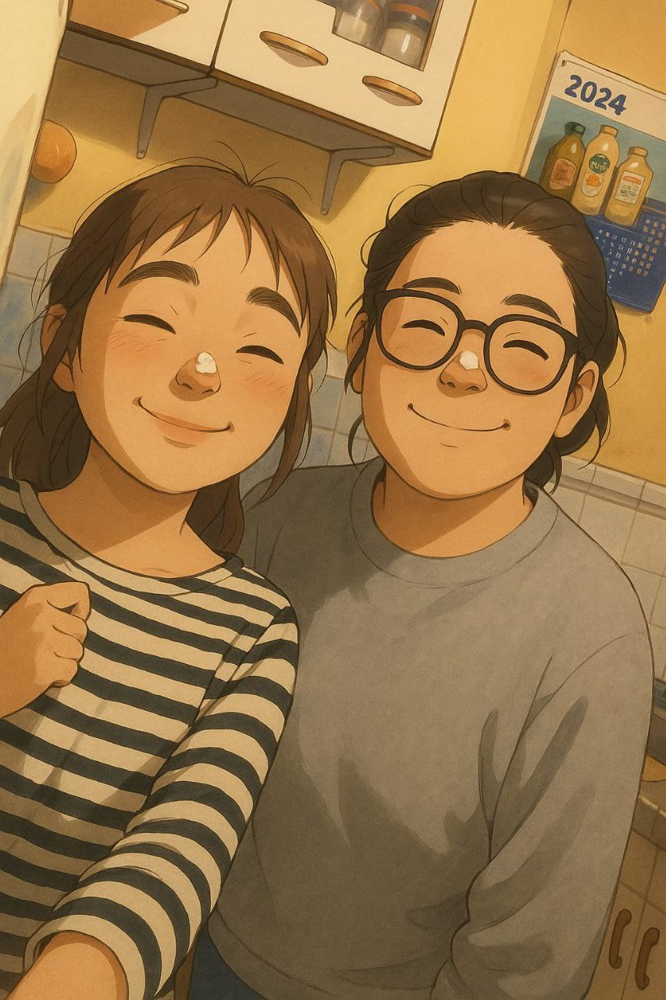

<!DOCTYPE html>
<html lang="es">
<head>
<meta charset="utf-8"/>
<meta name="viewport" content="width=device-width,initial-scale=1"/>
<title>No siempre que llueve es un desastre natural — Giro hacia ti</title>

<link rel="preconnect" href="https://fonts.googleapis.com">
<link rel="preconnect" href="https://fonts.gstatic.com" crossorigin>
<link href="https://fonts.googleapis.com/css2?family=Great+Vibes&family=Baloo+2:wght@400;700;800&display=swap" rel="stylesheet">

</head>
<body>

  <!-- CORAZÓN -->
  <section class="heart-screen" id="heartScreen">
    
🌸 El primero floreció.

    

      

        <svg viewBox="0 0 100 100" aria-hidden="true">
          <defs>
            <clipPath id="clipH">
              <path d="M50 86C50 86 9 61 9 36C9 23 20 12 33 12C41 12 47 16 50 22C53 16 59 12 67 12C80 12 91 23 91 36C91 61 50 86 50 86Z"/>
            </clipPath>
          </defs>
          <g clip-path="url(#clipH)">
            <rect id="level" class="level" x="10" y="86" width="80" height="0"></rect>
            <rect id="base" class="base" x="10" y="12" width="80" height="74"></rect>
            <g id="rise"></g>
            <g id="fill"></g>
          </g>
          <path class="outline" d="M50 86C50 86 9 61 9 36C9 23 20 12 33 12C41 12 47 16 50 22C53 16 59 12 67 12C80 12 91 23 91 36C91 61 50 86 50 86Z"/>
        </svg>
        

      

      
Tulipanes: 0/18

    

    
<button class="btn" id="btnTulip">🌷 Haz florecer otro tulipán</button>

    
Desde que llegaste, ya no hay espacio para nadie más.

  </section>

  <!-- SOBRE -->
  

    

      

      

      

      

      

      

    

  

  <!-- CARTA -->
  <article class="letter" id="letter" aria-live="polite">
    <h2 class="title">No siempre que llueve es un desastre natural</h2>

    
<b>He pensado mucho en nosotras, en las veces que peleamos y en todo lo que pasa después. Sé que muchas veces eres tú quien da el primer paso, quien busca arreglar las cosas, quien intenta acercarse aunque siga dolida. Y sí, sé que te duele que yo no haga lo mismo. Que esperes que vaya detrás de ti y que no lo haga te hace sentir que no me importa, pero te juro que no es así.</b>

    
<b>A veces necesito quedarme callada, pensar, ordenar todo lo que siento antes de hablar. No porque quiera alejarme, sino porque tengo miedo de decir algo sin pensar y lastimarte más. No es falta de ganas, ni de amor, es solo mi forma de cuidar algo que me importa mucho: tú.</b>

    
<b>No sabes cuántas veces me he quedado con las ganas de escribirte, de correr detrás de ti, pero termino frenándome porque no quiero que mis palabras salgan desde el enojo o la confusión. Y sé que desde afuera puede parecer que no me importa, pero en realidad es todo lo contrario.</b>

    
<b>Porque incluso en esos momentos donde parece que todo se rompe, yo sigo pensando en ti, sigo queriendo que estés bien, sigo queriéndote. Y aunque a veces no lo diga o no lo demuestre de la forma que esperas, quiero que sepas que me importas más de lo que crees, y que, a pesar de todo, nunca he dejado de elegirte, solo intento hacerlo bien, sin lastimarte.</b>

    
te quiere con todo su corazón M

  </article>

<!-- AUDIO -->
<audio id="song" src="morat.mp3" preload="auto" loop></audio>

Tu navegador bloqueó el audio. <button class="btn" id="playBtn" type="button">▶️ Reproducir</button>

<!-- Destello -->

</body>
</html>
